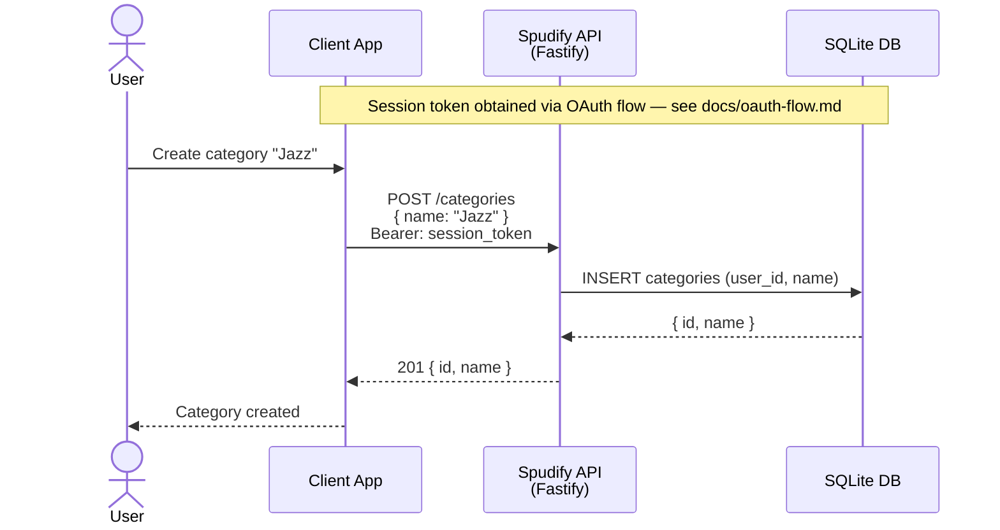
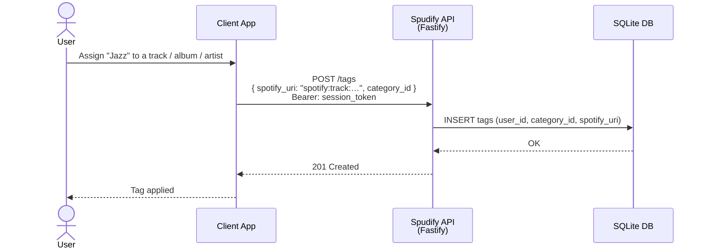
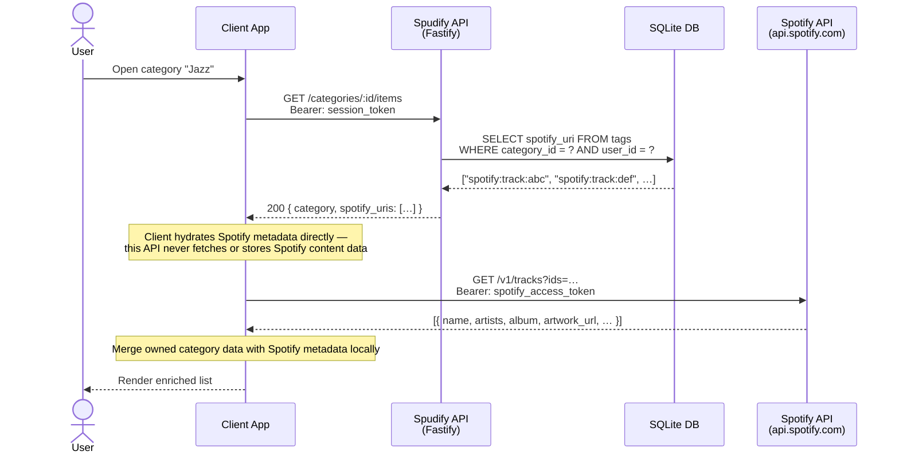
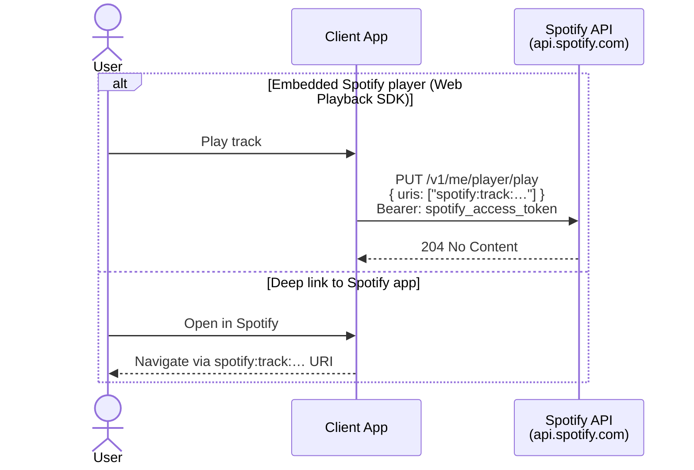

# Categorization Flow (Proposed)

Covers the core data flow for tagging Spotify entities with user-defined categories and retrieving enriched results. This API owns category data and URI relationships only — Spotify metadata hydration is delegated to the client.

## 1. Manage categories



## 2. Tag a Spotify entity



## 3. Browse a category



## 4. Playback



## Notes

- **Separation of ownership** — this API's database stores only Spotify URIs as opaque identifiers. Names, artwork, audio features, and all other Spotify content data are never written to SQLite. The client fetches that data directly from Spotify at read time.
- **Client Spotify access token** — the client needs a Spotify access token to call the Spotify API directly and to drive the Web Playback SDK. The mechanism for vending this token to the client (e.g. a `GET /auth/spotify-token` endpoint) is a separate design decision.
- **URI as the join key** — Spotify URIs (e.g. `spotify:track:…`, `spotify:album:…`, `spotify:artist:…`) are the stable identifiers used in join tables. They encode entity type, making it straightforward to tag mixed entity types under a single category.
- **Batch hydration** — Spotify's `/v1/tracks`, `/v1/albums`, and `/v1/artists` endpoints accept comma-separated IDs, so the client can hydrate a full category's items in a small number of requests rather than one per item.
- **ToS compliance** — fetching Spotify data at display time (rather than caching it persistently) keeps the design aligned with Spotify's developer terms, which restrict durable storage of content metadata.
```
