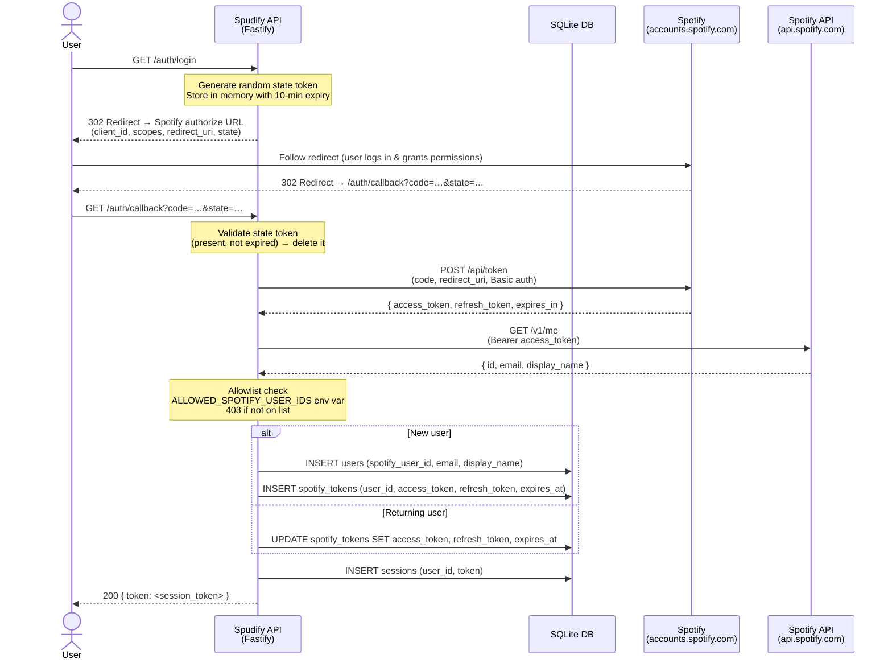

# OAuth Flow

Covers the Spotify OAuth 2.0 authorization code flow implemented in `src/routes/auth.ts`.

## Sequence diagram

## Notes

- **CSRF protection** — the `state` parameter is a 32-hex-character random token stored in-memory (`pendingStates` map). It is validated and immediately deleted on callback. Tokens expire after 10 minutes. This is intentionally in-memory because the app runs as a single process.
- **Allowlist** — set `ALLOWED_SPOTIFY_USER_IDS` as a comma-separated list of Spotify user IDs to restrict who can complete the flow. Leave unset to allow any Spotify account.
- **Token storage** — one row per user in `spotify_tokens` (enforced by a `UNIQUE` constraint on `user_id`). Re-authentication overwrites the existing row rather than appending.
- **Session token** — a 64-hex-character random token inserted into `sessions`. Returned to the caller as a bearer token for subsequent API requests.
